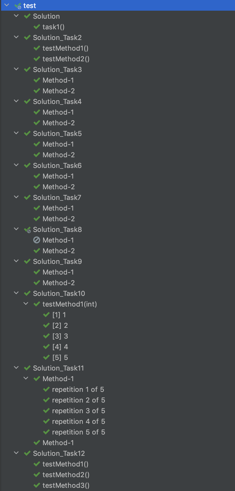

# Java-Testing: Annotations

## Overview

This submodule provides learners with an introduction to Junit 5 Annotations in Java Testing.

### Objectives

By the end of this submodule, the learners should be able to understand how to use Junit 5 Annotations.

## Materials and Resources

### Resources

- [JUnit 5 User Guide](https://junit.org/junit5/docs/current/user-guide/)
- [JUnit 5 Tutorial](https://howtodoinjava.com/junit-5-tutorial/)
- [Junit 5 Tutorial for Beginners](https://dev.to/saiupadhyayula/junit-5-tutorial-for-beginners-o8a)

### Exercises

The following section describes standalone exercises to give to students. For each exercise, follow the instructions below to share with your class:

1. Clone the repository locally
1. Re-upload it into your class' GitHub organization. **Make sure there is no solution branch in the uploaded repo**.
1. Share the link to the exercise repository with students.

# Write the Junit5 tests based on the given tasks. 

## Overview:
- In this exercise, you are going to write test cases using Junit5 Annotations.

## Task 1 -  @Test
    1. Create a TestClass which contains a test method using @Test annotation
    2. Update the test method which will print the below expected output:
    
#### Output
"Welcome to Junit"

## Task 2 -  @Test
**Create a TestClass with:**

   1. A test method which will print:       **"I am test method 1"**
   2. A test method which will print:       **"I am test method 2"**

Add appropriate annotations to the methods which will print the below expected output:
#### Output

    I am test method 1
    I am test method 2

## Task 3 - @BeforeAll
**Create a TestClass with:**

   1. A test method which will print :      **"I am test method 1"**
   2. A test method which will print:      **"I am test method 2"**
   3. A method which will print :        **"I am setup method"**

Add appropriate annotations to the non-test(setup) methods which will print the below expected output:

#### Output

    I am setup method
    I am test method 1

## Task 4 - @BeforeEach
**Create a TestClass with:**

1. A test method which will print:    **"I am test method 1"**
2. A test method which will print:    **"I am test method 2"**
3. A method which will print:   **"I am setup method"**

Add appropriate annotation to the method which will print the below expected output:

####Output
    I am setup method 
    I am test method
    I am setup method
    I am test method 2

## Task 5 - @AfterEach
**Create a TestClass with:**

1. A test method which will print : "I am test method 1"
2. A test method which will print : "I am test method 2"
3. A method which will print : "I am teardown method"

Add appropriate annotations to the non-test methods which will print the below expected output:

####Output
    I am test method 1
    I am teardown method
    I am test method 2
    I am teardown method

## Task 6 - @AfterAll
**Create a TestClass with:**

1. A test method which will print: "I am test method 1"
2. A test method which will print: "I am test method 2"
3. A method which will print: "I am teardown method"

Add appropriate annotations to the non-test(teardown) methods which will print the below expected output:

####Output
    I am test method 1 
    I am test method 2
    I am teardown method

## Task 7 - Multiple Annotations
**Create a TestClass with:**

1. A test method which will print : "I am test method 1"
2. test method which will print : "I am test method 2"
3. method which will print : "I am setup method"
4. method which will print : "I am teardown method"

Add appropriate annotations to the non-test methods which will print the below expected output:

####Output
    I am setup method
    I am test method 1
    I am teardown method
    I am setup method
    I am test method 1
    I am teardown method
    I am test method 2

## Task 8 - @Disabled
**Create a TestClass with:**

1. A test method which will print : "I am test method 1"
2. A test method which will print : "I am test method 2"

Add appropriate annotations to the test methods which will print the below expected output:

####Output
    I am test method 2

## Task 9 - @DisplayName
**Create a TestClass with:**

1. A test method which will print: "I am test method 1"
2. A test method which will print: "I am test method 2"

Add appropriate annotations to the methods, so that Junit "Test Result" window should display the test case names as below: "Method-1" "Method-2"

####Output
    I am test method 1
    I am test method 2

## Task 10 - @ParameterizedTest
**Create a TestClass with:**

Add @ParameterizedTest and @ValueSource annotations to the test method which will print the below expected output:

####Output
    I am test method 1
    I am test method 2
    I am test method 3
    I am test method 4
    I am test method 5

## Task 11 - @ParameterizedTest
**Create a TestClass with:**

1. A test method which will print : "I am test method 1"

Add appropriate annotations to the test method which will print the below expected output:

####Output
    I am test method 1
    I am test method 1
    I am test method 1
    I am test method 1
    I am test method 1   

## Task 12 - @TestMethodOrder
**Create a TestClass with:**

1. A test method which will print : "I am test method 1"
2. A test method which will print : "I am test method 2"
3. A test method which will print : "I am test method 3"

Add @TestMethodOrder & @Order to the test class and test methods which will print the below expected output:

####Output
    I am test method 2
    I am test method 3
    I am test method 1

When all the tests are passing, you should have an output similar to the one below:

 
