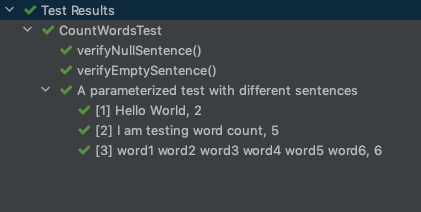
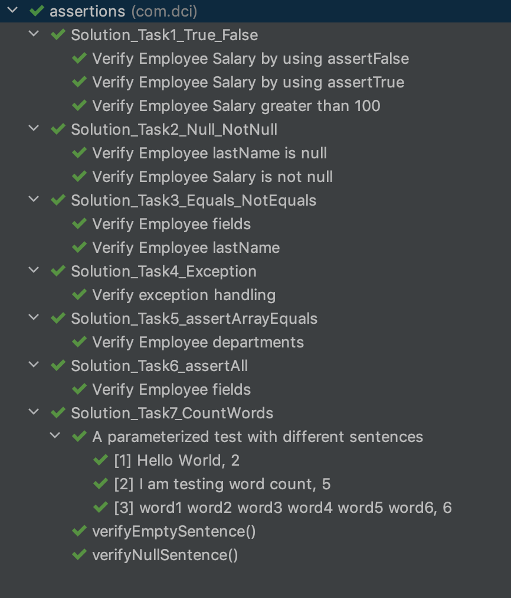

# Java-Testing: Assertions

## Overview

This submodule provides learners with an introduction to Junit 5 Assertions in Java Testing.

### Objectives

By the end of this submodule, the learners should be able to understand how to use Junit5 Assertions.

## Materials and Resources

### Resources

- [JUnit 5 User Guide](https://junit.org/junit5/docs/current/user-guide/)
- [JUnit 5 Tutorial](https://howtodoinjava.com/junit-5-tutorial/)
- [Junit 5 Tutorial for Beginners](https://dev.to/saiupadhyayula/junit-5-tutorial-for-beginners-o8a)

### Exercises

The following section describes standalone exercises to give to students. For each exercise, follow the instructions
below to share with your class:

1. Clone the repository locally
1. Re-upload it into your class' GitHub organization. **Make sure there is no solution branch in the uploaded repo**.
1. Share the link to the exercise repository with students.

# Write the Mockito tests based on the given tasks.

## Overview:

- In this exercise, you are going to write test cases using Juit5 assertions. There is already Employee.java exists. You
  need to create an object of this class as specified in each of the below tasks.

## Task 1 - true-false

Create Employee instance with below values:

    empId = 1001;   
    firstName = Hugo;
    lastName = Boss;
    salary = 500;

Write test methods to verify :

* Employee salary is 500 by using assertTrue()
* Employee salary is not 0 by using assertFalse()
* Employee salary is greater than 100 by using assertTrue()

## Task 2 - null and notNull

Create Employee instance with below values:

    empId = 1001;   
    firstName = Hugo;
    lastName = null;
    salary = 500;

Write test methods to verify :

* Employee lastName is null by using assert method: **assertNull()**
* Employee salary is not null by using assert method: **assertNotNull()**

## Task 3 - equals-notEquals

Create Employee instance with below values:

    empId = 1001;   
    firstName = Hugo;
    lastName = Boss;
    salary = 500;

Write test methods to verify :

* all fields of Employee objects are match with expected output using assertEquals()
* employee last name is not Hugo using assertNotEquals()

## Task 4 - Exceptions

### Overview

assertThrows() method ensures error/exception handling works correctly. Create Employee instance with below values:

    empId = 1001;   
    firstName = Hugo;
    lastName = null;
    departments = "sales", "admin"

Write test method to verify :

* IllegalArgumentException thrown during the object creation by using assertThrows()

## Task 5 - ArrayEquals

### Overview

assertArrayEquals() method ensures arrays have the items we expect.

Create Employee instance with below values:

    empId = 1001;   
    firstName = Hugo;
    lastName = null;
    departments = "sales", "admin"

Write test methods to verify :

* Employee departments are "sales" and "admin" by using **_assertArrayEquals()_**

## Task 5 - assertIterableEquals

Create Employee instance with below values:

    empId = 1001;   
    firstName = Hugo;
    lastName = null;
    departments = "sales", "admin"

Write test methods to verify :

* Employee departments are "sales" and "admin" by using assert method: **assertIterableEquals()**

## Task 6 - assertAll

Create Employee instance with below values:

    empId = 1001;   
    firstName = Hugo;
    lastName = Boss;
    salary = 500;

Write test method to verify :

* all fields of Employee objects are match with expected output using **_assertEquals()_** and assertAll()

## Task 7 - Exercise

#### Fix unit tests and code for the CountWords Program

#### Overview:

CountWords Program counts the numbers words given in a sentence. For example:

Input  | Output
--- | ---      
Hello world | 2
Welcome to Junit5 | 3

### Tasks

Given the CountWords program, there are failing tests, those need to be fixed by correcting the tests and main code

1. Fix _getNoOfWords()_ method in _CountWords.java_ so that _verifyWordCount()_ test method should pass.
2. Fix _verifyEmptySentence()_ test method which verifies count for empty sentence.
3. Fix _getNoOfWords()_ method in _CountWords.java_ which pass _verifyNullSentence()_ test method.

When all the tests are passing, you should have an output similar to the one below:

#### When all the tests are passing, you should have an output similar to the one below:

